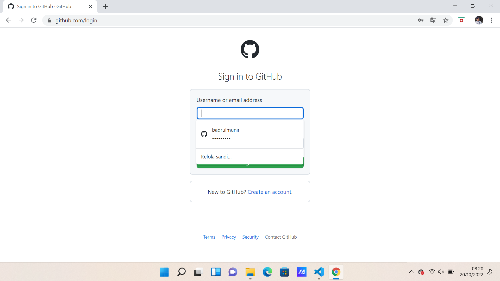
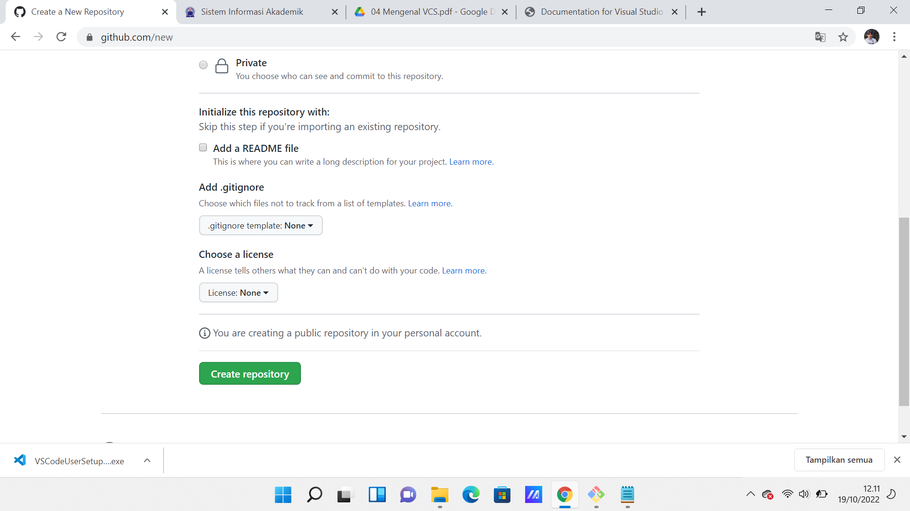

#LATIHANVCS
1. pastikan anda sudah mendownload aplikasi Gitnya(git-scm-com)

2. masuk ke web GitHub.Agar Git kita terhubung dengan GitHubkita harus membuat akun terlebih dahulu masuk web GitHub

3. Membuat repository server di git hub

4. Membuat repository local di penyimpanan laptop 

5. Menambahkan git global user.name dan global user.email di git bash ke dalam file yang baru dibuat

6. Menjadikan file yang baru dibuat menjadi file repository 

7. Membuat file README.md di dalam file repository yang baru dibuat

8. git add untuk memberi tahu git bash bahwa ada file baru di dalam repository dan merekam perubahan file repository dengan menggunakan command;
